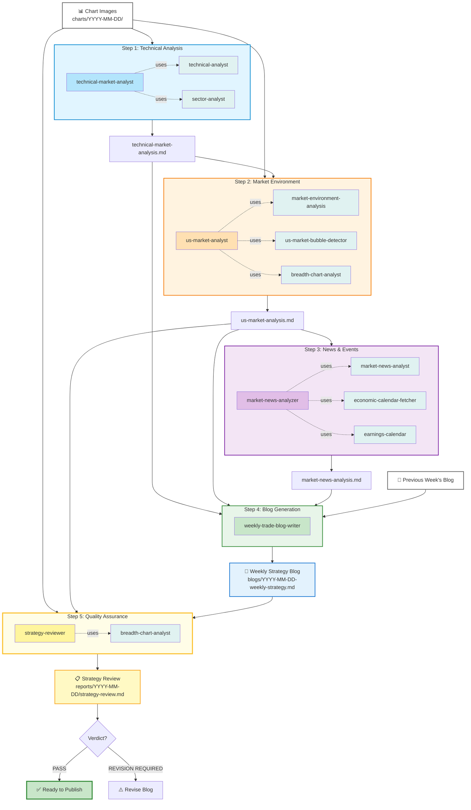
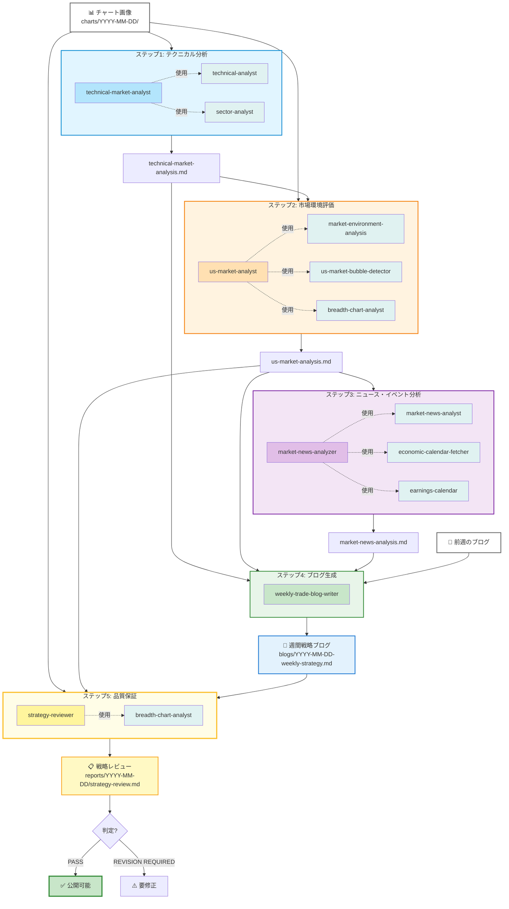

# Weekly Trade Strategy Blog Generator

An AI agent system that automatically generates weekly trading strategy blog posts for US stock markets using Claude Agents.

[English](#english) | [日本語](#japanese)

---

## <a name="english"></a>English

### Overview

An AI agent system that automatically generates weekly trading strategy blog posts for US stock markets using Claude Agents. The system performs step-by-step chart analysis, market environment evaluation, and news analysis to produce actionable strategy reports for part-time traders.

### Key Features

- **Technical Analysis**: Weekly chart analysis of VIX, yields, major indices, and commodities
- **Market Environment Assessment**: Bubble risk detection, sentiment analysis, sector rotation analysis, **Breadth chart analysis**
- **News & Event Analysis**: Past 10 days news impact evaluation, upcoming 7 days economic indicators and earnings forecasts
- **Weekly Strategy Blog Generation**: Integrates three analysis reports into a 200-300 line Markdown format trading strategy
- **Quality Assurance Review**: Mandatory strategy review step to verify chart readings accuracy before publication
- **Medium-Term Strategy Report** (Optional): 18-month Druckenmiller-style investment strategy with 4 scenarios (Base/Bull/Bear/Tail Risk)

### System Architecture

The system uses a 5-step workflow to generate weekly trading strategy blog posts:



**Workflow Overview:**
1. **Step 1**: `technical-market-analyst` analyzes charts using 2 skills → `technical-market-analysis.md`
2. **Step 2**: `us-market-analyst` evaluates market environment using 3 skills (including breadth-chart-analyst) → `us-market-analysis.md`
3. **Step 3**: `market-news-analyzer` analyzes news/events using 3 skills → `market-news-analysis.md`
4. **Step 4**: `weekly-trade-blog-writer` synthesizes all reports + previous week's blog → Weekly strategy blog
5. **Step 5**: `strategy-reviewer` verifies chart readings and strategy consistency → Quality assurance before publication

### Prerequisites

- **Claude Code CLI** (Required)
  - This project uses `.claude/agents/` feature, which is exclusive to Claude Code
  - Installation: https://docs.claude.ai/claude-code
- **FMP API** (Optional)
  - For automatic earnings and economic calendar retrieval
  - Free plan: 250 requests/day

**Note**: This project does not work with Claude Desktop as it does not support `.claude/agents/`. Please use Claude Code CLI.

### Quick Start

1. **Clone the repository**
```bash
git clone https://github.com/tradermonty/weekly-trade-strategy.git
cd weekly-trade-strategy
```

2. **Set up environment variables (Optional)**

**FMP API is not required** but recommended for automatic earnings and economic calendar retrieval.

| Feature | Without FMP API | With FMP API |
|---------|----------------|--------------|
| Chart Analysis | ✅ Fully functional | ✅ Fully functional |
| Market Environment | ✅ Fully functional | ✅ Fully functional |
| News Analysis | ⚠️ Partial | ✅ Full |
| Earnings Calendar | ❌ Manual check needed | ✅ Auto-retrieved |
| Economic Calendar | ❌ Manual check needed | ✅ Auto-retrieved |

**To use FMP API** (recommended):

```bash
echo "FMP_API_KEY=your_api_key_here" > .env
```

- Free plan: 250 requests/day (sufficient for weekly analysis)
- Sign up: https://site.financialmodelingprep.com/
- Setup time: ~5 minutes

**To use without FMP API**:

No `.env` file needed. You'll need to manually check earnings and economic calendars.

3. **Prepare chart images** (Recommended: 16 charts)

Create date folder and place weekly chart images:
```bash
mkdir -p charts/2025-11-17
# Add your chart images (.jpeg or .png) to charts/2025-11-17/
```

**Recommended Charts** (Weekly timeframe):
- **Volatility & Rates** (2): VIX, US 10-Year Treasury Yield
- **Major Indices** (4): Nasdaq 100, S&P 500, Russell 2000, Dow Jones
- **Commodities** (5): Gold, Copper, WTI Crude Oil, Natural Gas, Uranium ETF (URA)
- **Sectors** (3): Sector Performance (1-week, 1-month), Industry Performance
- **Breadth** (2, Optional): S&P 500 Breadth Index, Uptrend Stock Ratio

**Chart Sources**: TradingView, FinViz, StockCharts

4. **Run the complete workflow via Claude Code**

Example prompt for weekly blog generation:
```
Create a weekly trade strategy blog for the week of 2025-11-17.

1. Run technical-market-analyst on all charts in charts/2025-11-17/
   → reports/2025-11-17/technical-market-analysis.md

2. Run us-market-analyst for market environment assessment
   (IMPORTANT: Must read actual Breadth chart images using breadth-chart-analyst skill)
   → reports/2025-11-17/us-market-analysis.md

3. Run market-news-analyzer for news/event analysis
   → reports/2025-11-17/market-news-analysis.md

4. Run weekly-trade-blog-writer to generate final blog post
   → blogs/2025-11-17-weekly-strategy.md

5. Run strategy-reviewer for quality assurance
   (Re-verify Breadth chart readings and strategy consistency)
   → reports/2025-11-17/strategy-review.md

Execute each step sequentially and verify reports before proceeding to the next step.
Do NOT publish the blog until strategy-reviewer returns PASS verdict.
```

**Optional: Medium-Term Strategy Report**

Generate an 18-month Druckenmiller-style investment strategy (recommended quarterly):

```
Use druckenmiller-strategy-planner to create an 18-month strategy as of 2025-11-17.

Analyze the 3 reports under reports/2025-11-17/, apply Druckenmiller's strategic framework,
and save to reports/2025-11-17/druckenmiller-strategy.md.
```

Features:
- 18-month forward-looking macro analysis
- 4 scenarios (Base/Bull/Bear/Tail Risk) with probability estimates
- Conviction-based position sizing recommendations
- Identification of macro turning points (monetary policy, economic cycles)
- Clear invalidation conditions for each scenario

### Automated Trading System

The project includes a rule-based automated trading system that executes the blog strategies programmatically.

**Architecture (3-layer):**

| Layer | Role | Description |
|-------|------|-------------|
| **Layer 1** | Rule Engine | 15-min interval market checks, trigger detection (no LLM) |
| **Layer 2** | Claude Agent | Triggered only when Layer 1 detects scenario changes |
| **Layer 3** | Order Execution | Order validation, generation, and execution via Alpaca API |

**Setup:**

```bash
python -m venv .venv && source .venv/bin/activate
pip install -e .
```

**Environment variables** (`.env`):

```bash
ALPACA_API_KEY=your_key
ALPACA_SECRET_KEY=your_secret
FMP_API_KEY=your_fmp_key
ANTHROPIC_API_KEY=your_claude_key  # Layer 2 only
```

**Run:**

```bash
python -m trading.main --dry-run   # Paper trading mode
python -m trading.main --live      # Live trading (use with caution)
```

### Backtest Module

Backtest verification system for validating blog strategy performance against historical data.

**Modes:**

| Mode | Description |
|------|-------------|
| Phase A | Weekly rebalance to blog allocation on transition days |
| Phase B | Rule engine simulation with trigger detection and D+1 execution |
| `--benchmark` | Compare against SPY B&H, 60/40, Equal-Weight |
| `--cost-matrix` | Cost sensitivity analysis (4 modes x 5 cost levels) |
| `--full-robustness` | Complete robustness analysis with report |
| `--walk-forward` | Statistical significance testing (t-test, rolling windows) |

**Quick start:**

```bash
source .venv/bin/activate

# Basic run
python -m trading.backtest --start 2025-11-03 --end 2026-02-14 --phase B

# Walk-forward validation (sub-period consistency + statistical tests)
python -m trading.backtest --start 2025-11-03 --end 2026-02-14 \
  --phase B --walk-forward --output results/robustness/

# Full robustness analysis
python -m trading.backtest --start 2025-11-03 --end 2026-02-14 \
  --phase B --full-robustness --output results/robustness/
```

**Walk-forward validation** tests three axes:
1. **Per-Week Excess** - Weekly win rate and mean excess return vs SPY
2. **Rolling Windows** - 6-week rolling Sharpe/Return stability
3. **Statistical Tests** - Paired t-test on daily excess returns (scipy-free, `math.erfc` based)

Verdict: `SIGNIFICANT` (p<0.05 + win>=60%) / `INCONCLUSIVE` / `NOT_SIGNIFICANT`

### Project Structure

```
weekly-trade-strategy/
│
├── charts/                          # Chart images (user-provided)
│   └── YYYY-MM-DD/
│
├── reports/                         # Analysis reports (auto-generated)
│   └── YYYY-MM-DD/
│       ├── technical-market-analysis.md
│       ├── us-market-analysis.md
│       ├── market-news-analysis.md
│       └── druckenmiller-strategy.md  # (Optional)
│
├── blogs/                           # Final blog posts (auto-generated)
│   └── YYYY-MM-DD-weekly-strategy.md
│
├── trading/                         # Automated trading system
│   ├── core/                        # Constants, holidays, scheduler
│   ├── data/                        # SQLite models
│   ├── layer1/                      # Rule engine (15-min checks)
│   ├── layer2/                      # Claude agent integration
│   ├── layer3/                      # Order validation & execution
│   ├── services/                    # FMP, Alpaca, Email services
│   ├── backtest/                    # Backtest & walk-forward validation
│   │   ├── engine.py               # Phase A & B engines
│   │   ├── walk_forward.py         # Statistical significance testing
│   │   ├── robustness.py           # Cost sensitivity analysis
│   │   └── benchmark.py            # SPY B&H, 60/40, Equal-Weight
│   ├── tests/                       # 380+ tests
│   └── main.py                      # Entry point (--dry-run / --live)
│
├── .claude/
│   ├── agents/                      # Claude agent definitions (6 agents)
│   │   ├── technical-market-analyst.md
│   │   ├── us-market-analyst.md
│   │   ├── market-news-analyzer.md
│   │   ├── weekly-trade-blog-writer.md
│   │   ├── strategy-reviewer.md     # Quality assurance (Step 5)
│   │   └── druckenmiller-strategy-planner.md
│   │
│   └── skills/                      # Claude skill definitions (10 skills)
│       ├── technical-analyst/
│       ├── breadth-chart-analyst/
│       ├── sector-analyst/
│       ├── market-environment-analysis/
│       ├── us-market-bubble-detector/
│       ├── market-news-analyst/
│       ├── economic-calendar-fetcher/
│       ├── earnings-calendar/
│       └── stanley-druckenmiller-investment/
│
├── CLAUDE.md                        # Detailed workflow guide
├── README.md                        # This file
├── .env                             # Environment variables (create this)
└── .gitignore
```

### Agents

| Agent | Role | Output |
|-------|------|--------|
| `technical-market-analyst` | Chart-based technical analysis | `technical-market-analysis.md` |
| `us-market-analyst` | Market environment, bubble risk, and **Breadth chart analysis** | `us-market-analysis.md` |
| `market-news-analyzer` | News impact and event forecasting | `market-news-analysis.md` |
| `weekly-trade-blog-writer` | Final blog post generation | `YYYY-MM-DD-weekly-strategy.md` |
| `strategy-reviewer` | **Quality assurance** - verify chart readings before publication | `strategy-review.md` |
| `druckenmiller-strategy-planner` (Optional) | Medium-term (18-month) strategy planning (4-scenario analysis) | `druckenmiller-strategy.md` |

### Skills

Skills are specialized knowledge modules that agents use to perform specific tasks.

| Skill | Description | Used By |
|-------|-------------|---------|
| `technical-analyst` | Weekly chart technical analysis (trends, support/resistance, scenarios) | technical-market-analyst |
| `sector-analyst` | Sector/industry performance and rotation pattern analysis | technical-market-analyst |
| `breadth-chart-analyst` | S&P 500 Breadth Index & Uptrend Ratio analysis | us-market-analyst, strategy-reviewer |
| `market-environment-analysis` | Global market risk-on/risk-off assessment | us-market-analyst |
| `us-market-bubble-detector` | Quantitative bubble risk scoring (Minsky/Kindleberger framework) | us-market-analyst |
| `market-news-analyst` | Past 10 days news impact analysis | market-news-analyzer |
| `economic-calendar-fetcher` | Upcoming economic events via FMP API | market-news-analyzer |
| `earnings-calendar` | Upcoming earnings announcements via FMP API | market-news-analyzer |
| `stanley-druckenmiller-investment` | Druckenmiller's macro investment philosophy | druckenmiller-strategy-planner |
| `us-stock-analysis` | Individual US stock fundamental & technical analysis | (standalone) |

### Troubleshooting

**Q: Agent can't find charts**
- Verify `charts/YYYY-MM-DD/` folder exists
- Ensure image format is `.jpeg` or `.png`

**Q: Reports not generated**
- Check `reports/YYYY-MM-DD/` folder is created
- Verify previous step's report was generated successfully

**Q: Blog sector allocation changes drastically**
- Check previous week's blog exists in `blogs/` directory
- Agents are designed for gradual adjustments (±10-15%)

**Q: FMP API errors**
- Verify `FMP_API_KEY` is correctly set in `.env` file
- Check API key validity at [Financial Modeling Prep](https://site.financialmodelingprep.com/)

### Documentation

- **Workflow Guide**: See `CLAUDE.md` for detailed step-by-step workflow instructions

### Disclaimer

**IMPORTANT: This software is for educational and informational purposes only.**

- **NOT FINANCIAL ADVICE**: The analysis, strategies, and recommendations generated by this system do not constitute financial advice, investment recommendations, or solicitations to buy or sell securities.
- **NO GUARANTEES**: Past performance does not guarantee future results. Market analysis and predictions may be inaccurate.
- **RISK WARNING**: Trading and investing involve substantial risk of loss. You should only trade with capital you can afford to lose.
- **YOUR RESPONSIBILITY**: You are solely responsible for your own investment decisions. Always conduct your own research and consult with licensed financial advisors before making investment decisions.
- **NO LIABILITY**: The authors and contributors of this project accept no liability for any financial losses incurred through the use of this software.

By using this software, you acknowledge that you understand and accept these terms.

### License

This project is licensed under the MIT License.

### Contributing

Pull requests are welcome. For major changes, please open an issue first to discuss what you would like to change.

---

## <a name="japanese"></a>日本語

### 概要

このプロジェクトは、Claude Agentsを活用して、米国株市場の週間トレード戦略ブログを自動生成するシステムです。チャート分析、市場環境評価、ニュース分析を段階的に実行し、兼業トレーダー向けの実践的な戦略レポートを生成します。

### 主な機能

- **テクニカル分析**: VIX、金利、主要指数、コモディティの週足チャート分析
- **市場環境評価**: バブルリスク検出、センチメント分析、セクターローテーション分析、**Breadthチャート分析**
- **ニュース・イベント分析**: 過去10日間のニュース影響評価、今後7日間の経済指標・決算予測
- **週間戦略ブログ生成**: 3つの分析レポートを統合し、実践的なトレード戦略を200-300行のMarkdown形式で出力
- **品質保証レビュー**: ブログ公開前にチャート読み取り精度を検証する必須のレビューステップ
- **中長期戦略レポート**（オプション）: Druckenmiller流の18ヶ月投資戦略を4シナリオ（Base/Bull/Bear/Tail Risk）で生成

### システムアーキテクチャ

このシステムは5ステップのワークフローで週間トレード戦略ブログを生成します。



**ワークフロー概要:**
1. **ステップ1**: `technical-market-analyst`が2つのスキルを使用してチャート分析 → `technical-market-analysis.md`
2. **ステップ2**: `us-market-analyst`が3つのスキル（breadth-chart-analyst含む）を使用して市場環境評価 → `us-market-analysis.md`
3. **ステップ3**: `market-news-analyzer`が3つのスキルを使用してニュース・イベント分析 → `market-news-analysis.md`
4. **ステップ4**: `weekly-trade-blog-writer`が全レポート+前週ブログを統合 → 週間戦略ブログ
5. **ステップ5**: `strategy-reviewer`がチャート読み取りと戦略の整合性を検証 → 公開前の品質保証

### 前提条件

- **Claude Code CLI** (必須)
  - このプロジェクトは`.claude/agents/`機能を使用するため、Claude Code専用です
  - インストール: https://docs.claude.ai/claude-code
- **FMP API** (オプション)
  - 決算・経済カレンダー自動取得に使用
  - 無料プラン: 250リクエスト/日

**注意**: Claude Desktopでは`.claude/agents/`が利用できないため、このプロジェクトは動作しません。Claude Code CLIをご使用ください。

### セットアップ

1. **リポジトリのクローン**

```bash
git clone https://github.com/tradermonty/weekly-trade-strategy.git
cd weekly-trade-strategy
```

2. **環境変数の設定（オプション）**

**FMP APIは必須ではありません**が、今後7日間の決算・経済カレンダーを自動取得するために推奨されます。

| 機能 | FMP APIなし | FMP APIあり |
|------|------------|------------|
| チャート分析 | ✅ 完全動作 | ✅ 完全動作 |
| 市場環境評価 | ✅ 完全動作 | ✅ 完全動作 |
| ニュース分析 | ⚠️ 部分動作 | ✅ 完全動作 |
| 決算カレンダー | ❌ 手動確認必要 | ✅ 自動取得 |
| 経済カレンダー | ❌ 手動確認必要 | ✅ 自動取得 |

**FMP APIを使用する場合**:

`.env`ファイルを作成し、APIキーを設定：

```bash
# Financial Modeling Prep API (決算・経済カレンダー取得用)
FMP_API_KEY=your_api_key_here
```

- 無料プラン: 250リクエスト/日（週間分析には十分）
- 登録: https://site.financialmodelingprep.com/
- 所要時間: 約5分

**FMP APIなしで使用する場合**:

`.env`ファイルの作成は不要です。決算・経済カレンダーは手動で確認してください。

3. **フォルダ構造の確認**

```
weekly-trade-strategy/
├── charts/              # チャート画像格納フォルダ
├── reports/             # 分析レポート格納フォルダ
├── blogs/               # 最終ブログ記事格納フォルダ
├── .claude/
│   ├── agents/          # Claudeエージェント定義（6エージェント）
│   └── skills/          # Claudeスキル定義（10スキル）
├── CLAUDE.md            # 詳細なワークフローガイド
├── README.md            # このファイル
├── .env                 # 環境変数（要作成）
└── .gitignore
```

### 使い方

#### クイックスタート

1. **チャート画像を準備** (推奨16枚)

```bash
# 日付フォルダを作成
mkdir -p charts/2025-11-17

# チャート画像を配置
# 画像形式: .jpeg または .png
# ファイル名: 任意（説明的な名前を推奨）
```

**推奨チャート一覧** (週足チャートを推奨):

**ボラティリティ・金利** (2枚):
- VIX (CBOE Volatility Index) - 週足
- 米10年債利回り (US 10-Year Treasury Yield) - 週足

**主要株価指数** (4枚):
- Nasdaq 100 (週足)
- S&P 500 (週足)
- Russell 2000 (週足)
- Dow Jones Industrial Average (週足)

**コモディティ** (5枚):
- 金先物 (Gold Futures) - 週足
- 銅先物 (Copper Futures) - 週足
- 原油 (WTI Crude Oil) - 週足
- 天然ガス (Natural Gas) - 週足
- ウランETF (URA) - 週足

**セクター・マーケットブレス** (3枚):
- セクターパフォーマンス (1週間) - FinViz等
- セクターパフォーマンス (1ヶ月) - FinViz等
- インダストリーパフォーマンス (1週間または1ヶ月)

**その他** (2枚、オプション):
- S&P 500 Breadth Index (200日MA + 8日MA) - 別途分析
- Uptrend Stock Ratio (全市場) - 別途分析

**チャート取得先の例**:
- TradingView (https://www.tradingview.com/) - カスタマイズ可能な週足チャート
- FinViz (https://finviz.com/) - セクター・インダストリーパフォーマンス
- StockCharts (https://stockcharts.com/) - Breadth指標チャート

**注意**:
- すべて週足（Weekly）チャートを使用
- 画像サイズ: 推奨 1200x800px 以上（読みやすさのため）
- S&P 500 Breadth IndexとUptrend Ratioは別途breadth分析で使用（technical-market-analystではスキップ）

2. **レポートフォルダを作成**

```bash
mkdir -p reports/2025-11-17
```

3. **一括実行プロンプト** (Claude Codeで実行)

```
2025-11-17週のトレード戦略ブログを作成してください。

1. technical-market-analystでcharts/2025-11-17/の全チャートを分析
   → reports/2025-11-17/technical-market-analysis.md

2. us-market-analystで市場環境を総合評価
   （重要: breadth-chart-analystスキルで実際のBreadthチャートを必ず読み取ること）
   → reports/2025-11-17/us-market-analysis.md

3. market-news-analyzerでニュース/イベント分析
   → reports/2025-11-17/market-news-analysis.md

4. weekly-trade-blog-writerで最終ブログ記事を生成
   → blogs/2025-11-17-weekly-strategy.md

5. strategy-reviewerで品質保証レビューを実行
   （Breadthチャート読み取りと戦略の整合性を再検証）
   → reports/2025-11-17/strategy-review.md

各ステップを順次実行し、レポートを確認してから次に進んでください。
strategy-reviewerがPASS判定を出すまでブログを公開しないでください。
```

4. **オプション: 中長期戦略レポート生成**

週間ブログとは別に、18ヶ月の中長期投資戦略レポートを生成できます（四半期ごと推奨）。

```
druckenmiller-strategy-plannerエージェントで2025年11月17日時点の18ヶ月戦略を策定してください。

reports/2025-11-17/配下の3つのレポートを総合的に分析し、
Druckenmiller流の戦略フレームワークを適用して、
reports/2025-11-17/druckenmiller-strategy.mdに保存してください。
```

**特徴**:
- 18ヶ月先行の中長期マクロ分析
- 4つのシナリオ（Base/Bull/Bear/Tail Risk）と確率評価
- 確信度に基づくポジションサイジング推奨
- マクロ転換点（金融政策、景気サイクル）の識別
- 各シナリオの無効化条件を明示

#### ステップ別実行

より詳細な手順は `CLAUDE.md` を参照してください。

### 自動売買システム

ブログ戦略をプログラマティックに実行するルールベースの自動売買システムを含んでいます。

**アーキテクチャ（3層構造）:**

| レイヤー | 役割 | 説明 |
|---------|------|------|
| **Layer 1** | ルールエンジン | 15分間隔の市場チェック、トリガー検出（LLM不使用） |
| **Layer 2** | Claude Agent | Layer 1がシナリオ変化を検出した場合のみ起動 |
| **Layer 3** | 注文執行 | 注文バリデーション、生成、Alpaca API経由の執行 |

**セットアップ:**

```bash
python -m venv .venv && source .venv/bin/activate
pip install -e .
```

**実行:**

```bash
python -m trading.main --dry-run   # ペーパートレードモード
python -m trading.main --live      # ライブトレード（要注意）
```

### バックテストモジュール

ブログ戦略のパフォーマンスを過去データで検証するバックテストシステム。

**モード:**

| モード | 説明 |
|--------|------|
| Phase A | ブログ更新日にアロケーションへリバランス |
| Phase B | ルールエンジンシミュレーション（トリガー検出 + D+1執行） |
| `--benchmark` | SPY B&H、60/40、等配分との比較 |
| `--cost-matrix` | コスト感応度分析（4モード x 5コストレベル） |
| `--full-robustness` | 完全ロバストネス分析（レポート出力付き） |
| `--walk-forward` | 統計的有意性テスト（t検定、ローリング窓分析） |

**クイックスタート:**

```bash
source .venv/bin/activate

# 基本実行
python -m trading.backtest --start 2025-11-03 --end 2026-02-14 --phase B

# Walk-forward検証（サブ期間一貫性 + 統計検定）
python -m trading.backtest --start 2025-11-03 --end 2026-02-14 \
  --phase B --walk-forward --output results/robustness/

# 完全ロバストネス分析
python -m trading.backtest --start 2025-11-03 --end 2026-02-14 \
  --phase B --full-robustness --output results/robustness/
```

**Walk-forward検証**は3つの軸でテスト:
1. **週次超過リターン** - 対SPY週次勝率・平均超過リターン
2. **ローリング窓** - 6週ローリングでSharpe/Returnの安定性
3. **統計検定** - 日次超過リターンの対応t検定（scipy不要、`math.erfc`ベース）

判定: `SIGNIFICANT`（p<0.05 かつ勝率>=60%）/ `INCONCLUSIVE` / `NOT_SIGNIFICANT`

### プロジェクト構造

詳細は英語セクションの「Project Structure」を参照してください。

### エージェント一覧

| エージェント | 役割 | 出力 |
|---------|------|------|
| `technical-market-analyst` | チャート画像からテクニカル分析を実行 | `technical-market-analysis.md` |
| `us-market-analyst` | 市場環境、バブルリスク、**Breadthチャート分析** | `us-market-analysis.md` |
| `market-news-analyzer` | ニュース影響とイベント予測を分析 | `market-news-analysis.md` |
| `weekly-trade-blog-writer` | 3つのレポートを統合してブログ記事を生成 | `YYYY-MM-DD-weekly-strategy.md` |
| `strategy-reviewer` | **品質保証** - 公開前にチャート読み取り精度を検証 | `strategy-review.md` |
| `druckenmiller-strategy-planner`（オプション） | 中長期（18ヶ月）戦略プランニング（4シナリオ分析） | `druckenmiller-strategy.md` |

### スキル一覧

スキルは、エージェントが特定のタスクを実行するために使用する専門知識モジュールです。

| スキル | 説明 | 使用エージェント |
|--------|------|-----------------|
| `technical-analyst` | 週足チャートのテクニカル分析（トレンド、サポート/レジスタンス、シナリオ） | technical-market-analyst |
| `sector-analyst` | セクター・インダストリーパフォーマンスとローテーション分析 | technical-market-analyst |
| `breadth-chart-analyst` | S&P 500 Breadth Index & Uptrend Ratio分析 | us-market-analyst, strategy-reviewer |
| `market-environment-analysis` | グローバル市場のリスクオン/リスクオフ評価 | us-market-analyst |
| `us-market-bubble-detector` | バブルリスクの定量スコアリング（Minsky/Kindlebergerフレームワーク） | us-market-analyst |
| `market-news-analyst` | 過去10日間のニュース影響分析 | market-news-analyzer |
| `economic-calendar-fetcher` | FMP APIで今後の経済イベントを取得 | market-news-analyzer |
| `earnings-calendar` | FMP APIで今後の決算発表を取得 | market-news-analyzer |
| `stanley-druckenmiller-investment` | ドラッケンミラーのマクロ投資哲学 | druckenmiller-strategy-planner |
| `us-stock-analysis` | 米国個別株のファンダメンタル・テクニカル分析 | （単独使用） |

### トラブルシューティング

**Q: エージェントがチャートを見つけられない**
- `charts/YYYY-MM-DD/` フォルダが存在するか確認
- 画像形式が `.jpeg` または `.png` であることを確認

**Q: レポートが生成されない**
- `reports/YYYY-MM-DD/` フォルダが作成されているか確認
- 前のステップのレポートが正常に生成されているか確認

**Q: ブログ記事のセクター配分が急変している**
- 前週のブログ記事が `blogs/` ディレクトリに存在するか確認
- エージェントは段階的調整（±10-15%）を行うよう設計されています

**Q: FMP APIエラーが発生する**
- `.env` ファイルに `FMP_API_KEY` が正しく設定されているか確認
- APIキーの有効性を確認（[Financial Modeling Prep](https://site.financialmodelingprep.com/)）

### 免責事項

**重要: このソフトウェアは教育および情報提供のみを目的としています。**

- **投資助言ではありません**: このシステムが生成する分析、戦略、推奨事項は、金融アドバイス、投資推奨、または証券の売買の勧誘を構成するものではありません。
- **保証はありません**: 過去のパフォーマンスは将来の結果を保証するものではありません。市場分析や予測は不正確な場合があります。
- **リスク警告**: トレードや投資には大きな損失リスクが伴います。失っても良い資金のみで取引してください。
- **自己責任**: ご自身の投資判断については、ご自身が全責任を負います。投資判断を行う前に、必ずご自身で調査を行い、認可を受けた金融アドバイザーに相談してください。
- **免責**: このプロジェクトの著者および貢献者は、本ソフトウェアの使用により生じたいかなる金銭的損失についても責任を負いません。

このソフトウェアを使用することにより、これらの条項を理解し、同意したものとみなされます。

### ライセンス

このプロジェクトはMITライセンスの下で公開されています。

### 貢献

プルリクエストを歓迎します。大きな変更の場合は、まずissueを開いて変更内容を議論してください。
